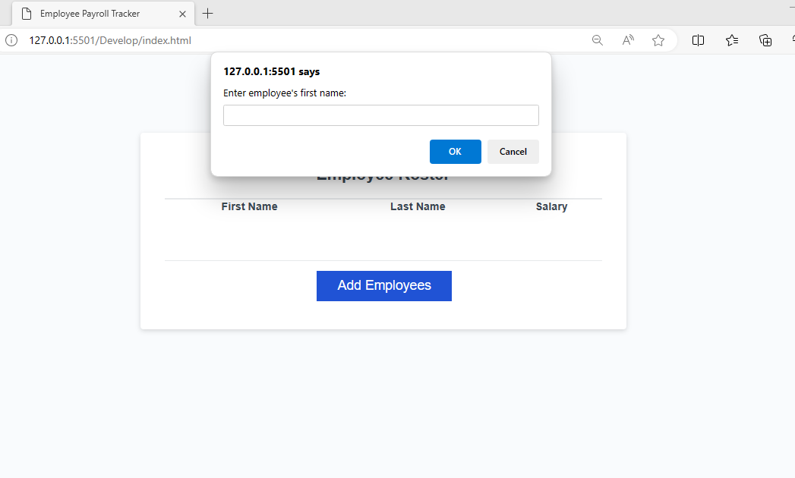

# Emploee Payroll

## Introduction
This project creates a page where the user can make a list of employees organized alphabetically by last name. It tracks first name, last name, and their salary.   

## Usage
To use this project, click the add eemployee button on the webpage. Continue answering the prompts until you have entered the desired amount of employees. When done, press cancel. The page will load all of the data that you entered in alphabetical order. 

## Screenshot

## License
This project is licensed under the MIT LICENSE. See the [LICENSE](LICENSE) file for details.